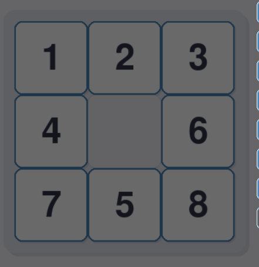
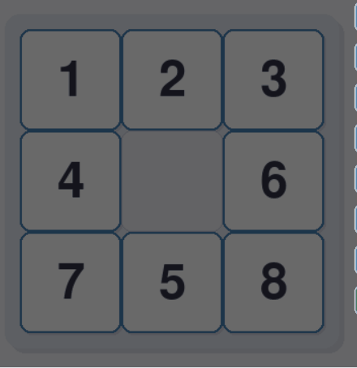
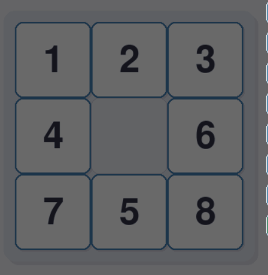

# Do_an_ca_nhan_mon_AI
# 1. Giới thiệu bài toán 8_puzzle
Bài toán 8-puzzle (hay còn gọi là bài toán Ta-canh)

Một bảng 3×3 với các ô trong đó có số từ 1 ->8 và 1 ô trống, các ô được đặt ở các vị trí ngẫu nhiên, ô trống và ô số có thể đổi chỗ cho nhau, tìm cách di chuyển các ô sao cho các con số về đúng thứ tự, bài toán đặt ra ở đây là tìm phương án tối ưu sao cho số lần di chuyển là ít nhất.

# 2. Nội dung

## 2.1. Nhóm thuật toán tìm kiếm không có thông tin (Uninformed Search Algorithms)
Các thành phần chính của bài toán tìm kiếm và giải pháp

+ Trạng thái ban đầu
    - Một lưới 3x3 với 8 số từ 1 đến 8 và một ô trống (0), đại diện cho trạng thái khởi đầu của bài toán ([[1 2 3], [0 5 6], [4 7 8]]).
+ Trạng thái mục tiêu
    - Lưới 3x3 với thứ tự số từ 1 đến 8 và ô trống ở vị trí cuối cùng ([[1 2 3], [4 5 6], [7 8 0]]).
+ Không gian trạng thái
    - Tập hợp tất cả các cấu hình có thể của lưới 3x3 hay các cách sắp xếp cụ thể vị trí các ô.
+ Hành động
    - Di chuyển ô trống lên, xuống, trái, phải để hoán đổi với ô số liền kề.
+ Chi phí
    - Mỗi bước di chuyển có chi phí bằng 1, vì bài toán ưu tiên tìm đường đi ngắn nhất.
+ Giải pháp
    - Dãy các trạng thái từ trạng thái ban đầu đến trạng thái mục tiêu, được tạo ra bởi các: Thuật toán tìm kiếm không có thông tin (BFS, DFS, UCS, IDS); Thuật toán tìm kiếm có thông tin (A*, Greedy, IDA*); Thuật toán tìm kiếm cục bộ ( Local Beam, Simple Hill Climbing, 

### 2.1.1. BFS
BFS là thuật toán duyệt đồ thị hoặc cây theo chiều rộng, tức là nó sẽ duyệt hết tất cả các đỉnh ở một mức (level) trước khi chuyển sang mức tiếp theo.
+ Cấu trúc dữ liệu sử dụng trong BFS
  - Hàng đợi(Queue): dùng để lưu các đỉnh cần duyệt tiếp theo.
  - Tập hợp hoặc đánh dấu (visited): để tránh duyệt lại đỉnh đã thăm.
+ Hình ảnh minh họa: 
  

  
### 2.1.2. DFS
DFS là thuật toán duyệt đồ thị hoặc cây theo chiều sâu – tức là nó sẽ đi sâu theo từng nhánh trước khi quay lại và duyệt các nhánh còn lại.
+ Cấu trúc dữ liệu sử dụng trong DFS
  - Ngăn xếp(Stack): DFS bản chất là đi sâu xuống từng nhánh → sử dụng ngăn xếp (stack) để lưu các đỉnh chờ được khám phá.
  - Tập hợp các visited để tránh lặp vô hạn (đặc biệt trong đồ thị có chu trình), cần lưu lại các đỉnh đã thăm:
      - Set (tập hợp): Dễ sử dụng, truy cập nhanh O(1)
      - Mảng đánh dấu (boolean array): Dùng khi đỉnh là số nguyên (0 → n-1)
+ Hình ảnh minh họa:
  
  
        
### 2.1.3. IDS (Iterative Deepening Search)
IDS (Iterative Deepening Search – Tìm kiếm mở rộng lặp) là sự kết hợp giữa DFS và BFS. Nó thực hiện nhiều lần DFS với độ sâu giới hạn, tăng dần theo từng bước.
Đây là thuật toán tìm kiếm theo chiều sâu có giới hạn, lặp đi lặp lại với giới hạn độ sâu tăng dần (depth limit = 0 → 1 → 2 → ...), cho đến khi tìm thấy lời giải.
+ Cấu trúc dữ liệu sử dụng trong IDS
  - Call Stack (ngăn xếp hàm): khi dùng DFS đệ quy trong mỗi vòng lặp giới hạn độ sâu
  - Tập hợp/array đánh dấu (visited): giúp tránh lặp đỉnh (nếu cần) – thường dùng trong đồ thị
  - Vòng lặp ngoài (for depth in range(...)): kiểm soát giới hạn độ sâu của DFS
+ Hình ảnh minh họa:

    

  
    
### 2.1.4. UCS (Uniform-Cost Search)
UCS (Uniform Cost Search – Tìm kiếm theo chi phí đồng nhất) là một thuật toán tìm kiếm trên đồ thị/cây giống như BFS, nhưng thay vì duyệt theo mức, nó duyệt theo chi phí đường đi nhỏ nhất từ gốc đến đỉnh hiện tại.
+ Cấu trúc dữ liệu sử dụng trong UCS
  - Priority Queue (heap): luôn chọn đường đi có chi phí thấp nhất để mở rộng tiếp theo
  - Tập visited / closed set: đánh dấu các đỉnh đã xử lý để tránh lặp lại
  - Danh sách kề: biểu diễn đồ thị và chi phí cạnh giữa các đỉnh
  - Tuple (chi phí, đỉnh): gói thông tin cần thiết cho priority queue

## 2.2. Nhóm thuật toán tìm kiếm có thông tin (Informed Search Algorithms)
Các thành phần chính của bài toán tìm kiếm và giải pháp

+ Trạng thái ban đầu
    - Một lưới 3x3 với 8 số từ 1 đến 8 và một ô trống (0), đại diện cho trạng thái khởi đầu của bài toán ([[1 2 3], [4 0 6], [7 5 8]]).
+ Trạng thái mục tiêu
    - Lưới 3x3 với thứ tự số từ 1 đến 8 và ô trống ở vị trí cuối cùng ([[1 2 3], [4 5 6], [7 8 0]]).
+ Không gian trạng thái
    - Tập hợp tất cả các cấu hình có thể của lưới 3x3 hay các cách sắp xếp cụ thể vị trí các ô.
+ Hành động
    - Di chuyển ô trống lên, xuống, trái, phải để hoán đổi với ô số liền kề.
+ Chi phí
    - Mỗi bước di chuyển có chi phí bằng 1, vì bài toán ưu tiên tìm đường đi ngắn nhất.
+ Giải pháp
    - Dãy các trạng thái từ trạng thái ban đầu đến trạng thái mục tiêu, được tạo ra bởi các:  Thuật toán tìm kiếm có thông tin (A*, Greedy, IDA*).
### 2.2.1. A*
Thuật toán A* (A star) là một thuật toán tìm kiếm theo định hướng heuristic, được sử dụng rộng rãi để tìm đường đi ngắn nhất trong các bài toán như bản đồ, game, robot, AI, v.v. Nó là sự kết hợp giữa thuật toán Dijkstra (ưu tiên đường đi ngắn nhất) và thuật toán Greedy Best-First Search (ưu tiên điểm đến). Mục tiêu của A* là tìm đường đi ngắn nhất từ điểm bắt đầu (start) đến điểm đích (goal), với chi phí thấp nhất. 
A* dùng 1 hàm chi phí đánh giá tổng quát:
+ f(n)= g(n) + h(n)
+ Trong đó:
  - g(n): chi phí thực tế từ điểm bắt đầu đến nút hiện tại n.
  - h(n): chi phí ước lượng từ nút hiện tại đến đích (heuristic).
  - f(n): tổng chi phí ước lượng của hành trình đi qua nút đó.
+ Cấu trúc dữ liệu sử dụng trong A*:
  - Priority Queue (hàng đợi ưu tiên, thường dùng heapq trong Python): để chọn nút có chi phí f(n) nhỏ nhất để mở tiếp.
  - Open set (thường là một priority queue): danh sách các nút chờ xét tiếp theo.
  - Closed set (thường là set hoặc dict): danh sách các nút đã xét, tránh lặp lại.
  - Bản đồ cha (came_from) (dict): dùng để truy vết đường đi sau khi tìm xong.
  - g_score (dict): lưu chi phí thực từ start đến từng nút.
+ Hình ảnh minh họa:
  
### 2.2.2. Greedy
Thuật toán Greedy (Tham lam) là một chiến lược giải bài toán bằng cách luôn chọn lựa phương án tối ưu nhất tại mỗi bước với hy vọng rằng tổng thể cũng sẽ là tối ưu.
+ Cấu trúc dữ liệu sử dụng trong Greedy:
  - Danh sách hoặc mảng: Lưu các đối tượng.
  - Sắp xếp (Sorting): Greedy thường bắt đầu bằng việc sắp xếp theo một tiêu chí (ví dụ: lợi nhuận, trọng lượng,...).
  - Priority Queue: Một số bài toán cần truy xuất phần tử tốt nhất nhiều lần.
+ Hình ảnh minh họa:
  
### 2.2.3. IDA*
IDA* (Iterative Deepening A*) là một thuật toán kết hợp giữa: DFS (Depth-First Search) – để giảm bộ nhớ, A* – để đảm bảo tìm kiếm theo hướng heuristic. Nó thường dùng cho các bài toán có không gian trạng thái lớn như 8-puzzle, 15-puzzle, Rubik’s cube, nơi A* tốn quá nhiều bộ nhớ vì lưu toàn bộ cây tìm kiếm.
+ Cấu trúc dữ liệu sử dụng trong IDA*:
  - Stack (hệ thống gọi đệ quy): để thực hiện DFS.
  - Hàm heuristic h(n): thường là: Khoảng cách Manhattan (cho 8-puzzle) và Hamming distance.
  - Visited path (tạm thời): để tránh quay lui trong DFS.
+ Hình ảnh minh hoa:

## 2.3. Nhóm thuật toán tìm kiếm cục bộ (Local Optimization Algorithms)
Các thành phần chính của bài toán tìm kiếm và giải pháp

+ Trạng thái ban đầu
    - Một lưới 3x3 với 8 số từ 1 đến 8 và một ô trống (0), đại diện cho trạng thái khởi đầu của bài toán ([[1 2 3], [4 0 5], [7 5 8]]).
+ Trạng thái mục tiêu
    - Lưới 3x3 với thứ tự số từ 1 đến 8 và ô trống ở vị trí cuối cùng ([[1 2 3], [4 5 6], [7 8 0]]).
+ Không gian trạng thái
    - Tập hợp tất cả các cấu hình có thể của lưới 3x3 hay các cách sắp xếp cụ thể vị trí các ô.
+ Hành động
    - Di chuyển ô trống lên, xuống, trái, phải để hoán đổi với ô số liền kề.
+ Chi phí
    - Mỗi bước di chuyển có chi phí bằng 1, vì bài toán ưu tiên tìm đường đi ngắn nhất.
+ Giải pháp
    - Dãy các trạng thái từ trạng thái ban đầu đến trạng thái mục tiêu, được tạo ra bởi các: Thuật toán tìm kiếm cục bộ (Simple Hill Climbing, Steepest-Ascent hill climbing, Beam search, Stochastic hill climbing).

### 2.5.1. Simple hill climbing
Hill Climbing là một thuật toán tìm kiếm theo hướng (heuristic). Nó liên tục di chuyển theo hướng tăng dần của giá trị đánh giá (hàm heuristic) — giống như người leo núi chỉ nhìn thấy chỗ cao hơn hiện tại và luôn cố leo lên đó.
+ Cấu trúc dữ liệu sử dụng trong Simple hill climbing:
  - State: đại diện cho trạng thái hiện tại.
  - Heuristic function (h(n)): đánh giá "độ tốt" của trạng thái.
  - Neighbor generator: sinh trạng thái lân cận.
+ Hình ảnh minh họa:
### 2.5.2. Steepest-Ascent hill climbing
Steepest-Ascent Hill Climbing là phiên bản cải tiến của Simple Hill Climbing. Thay vì chỉ chọn một hàng xóm bất kỳ tốt hơn trạng thái hiện tại, thuật toán xét tất cả các hàng xóm và chọn hàng xóm tốt nhất (tức có giá trị heuristic cao nhất – hoặc thấp nhất nếu đang tìm giá trị nhỏ nhất).
+ Cấu trúc dữ liệu của Steepest-Ascent hill climbing:
  - State: đại diện trạng thái hiện tại.
  - Heuristic function h(n): đánh giá "độ tốt" của một trạng thái.
  - List of neighbors: để duyệt tất cả hàng xóm.
+ Hình ảnh minh họa:
### 2.5.3. Beam search
Beam Search là một thuật toán tìm kiếm heuristic giống như BFS kết hợp với A*, nhưng giới hạn số lượng nhánh được mở rộng tại mỗi bước để tiết kiệm tài nguyên.
+ Cấu trúc dữ liệu sử dụng trong Beam search
  - List hàng đợi hiện tại (current_level) – trạng thái ở bước hiện tại.
  - Danh sách các hàng xóm – sinh từ các trạng thái trong current_level.
  - Hàm heuristic h(n) – đánh giá độ tốt của trạng thái.
  - Beam width (k) – số trạng thái tốt nhất giữ lại ở mỗi bước.
+ Hình ảnh minh họa:
### 2.5.4. Stochastic hill climbing
Stochastic Hill Climbing là một biến thể của thuật toán hill climbing, trong đó không chọn luôn hàng xóm tốt nhất, mà chọn ngẫu nhiên một hàng xóm tốt hơn hiện tại. Điều này giúp tránh bị kẹt trong local maximum và vùng plateau.
+ Cấu trúc dữ liệu sử dụng trong Stochastic hill climbing
  - State: trạng thái hiện tại.
  - Heuristic function h(n): đánh giá độ tốt của trạng thái.
  - Danh sách các hàng xóm: để chọn ra hàng xóm tốt hơn.
  - random.choice(): chọn ngẫu nhiên 1 hàng xóm tốt.
+ Hình ảnh minh họa:

## 2.4. Nhóm thuật toán tìm kiếm trong môi trường phức tạp (Search in complex environments)
Các thành phần chính của bài toán tìm kiếm và giải pháp

+ Trạng thái ban đầu
    - Một lưới 3x3 với 8 số từ 1 đến 8 và một ô trống (0), đại diện cho trạng thái khởi đầu của bài toán ([[1 2 3], [4 0 5], [7 5 8]]).
+ Trạng thái mục tiêu
    - Lưới 3x3 với thứ tự số từ 1 đến 8 và ô trống ở vị trí cuối cùng ([[1 2 3], [4 5 6], [7 8 0]]).
+ Không gian trạng thái
    - Tập hợp tất cả các cấu hình có thể của lưới 3x3 hay các cách sắp xếp cụ thể vị trí các ô.
+ Hành động
    - Di chuyển ô trống lên, xuống, trái, phải để hoán đổi với ô số liền kề.
+ Chi phí
    - Mỗi bước di chuyển có chi phí bằng 1, vì bài toán ưu tiên tìm đường đi ngắn nhất.
+ Giải pháp
    - Dãy các trạng thái từ trạng thái ban đầu đến trạng thái mục tiêu, được tạo ra bởi các: Thuật toán tìm kiếm cục bộ (Search with no observation, Search with partically observation).
### 2.4.1. Search with no observation
Search with No Observation (Tìm kiếm không quan sát) là một dạng tìm kiếm trong môi trường không xác định, trong đó agent (tác nhân) không thể quan sát trạng thái hiện tại của môi trường sau mỗi hành động.
+ Cấu trúc dữ liệu sử dụng trong Search with no observation
  - belief_state: Trạng thái không chắc chắn hiện tại.
  - frontier: Các belief states đang xét
  - explored: Các belief states đã xét
  - transition model: Biểu diễn mô hình hành động
  - goal_test: Kiểm tra belief state đạt đích
+ Hình ảnh minh họa:

### 2.4.2. Search with partically observation
Thuật toán Search with partially observable (Tìm kiếm với quan sát một phần) được sử dụng trong các bài toán trong đó tác nhân (agent) không thể quan sát toàn bộ trạng thái của môi trường. Thay vào đó, tác nhân chỉ có thể quan sát một phần của môi trường, điều này dẫn đến các vấn đề về không đầy đủ thông tin. Thuật toán này thường được áp dụng trong các trò chơi, robot tự hành, hoặc các hệ thống thông minh nơi tác nhân phải đưa ra quyết định dựa trên thông tin hạn chế.
+ Cấu trúc dữ liệu sử dụng trong Search with partically observation
  - Lịch sử quan sát (Observation History): Lưu trữ các quan sát đã nhận được theo thời gian. Cấu trúc này giúp theo dõi các thông tin mà tác nhân đã quan sát.
  - Belief State: Mảng hoặc từ điển (dict) lưu trữ xác suất của các trạng thái có thể có, ước lượng từ các quan sát đã nhận được.
  - Queue hoặc Stack: Dùng cho các thuật toán tìm kiếm như BFS (queue) hoặc DFS (stack) để quản lý các trạng thái cần khám phá.
  - *Priority Queue (cho A)**: Hàng đợi ưu tiên giúp tổ chức các trạng thái dựa trên chi phí ước tính, cho phép lựa chọn trạng thái tốt nhất để mở rộng tiếp.
  - HashMap hoặc Dict: Lưu trữ các trạng thái hoặc kết quả trung gian trong quá trình tìm kiếm, hỗ trợ tra cứu nhanh.
+ Hình ảnh minh họa:

## 2.5. Nhóm thuật toán tìm kiếm thỏa ràng buộc (Constraint Satisfaction Problem)
Các thành phần chính của bài toán tìm kiếm và giải pháp

+ Trạng thái ban đầu
    - Một lưới 3x3 với 8 số từ 1 đến 8 và một ô trống (0), đại diện cho trạng thái khởi đầu của bài toán ([[1 2 3], [4 0 5], [7 5 8]]).
+ Trạng thái mục tiêu
    - Lưới 3x3 với thứ tự số từ 1 đến 8 và ô trống ở vị trí cuối cùng ([[1 2 3], [4 5 6], [7 8 0]]).
+ Không gian trạng thái
    - Tập hợp tất cả các cấu hình có thể của lưới 3x3 hay các cách sắp xếp cụ thể vị trí các ô.
+ Hành động
    - Di chuyển ô trống lên, xuống, trái, phải để hoán đổi với ô số liền kề.
+ Chi phí
    - Mỗi bước di chuyển có chi phí bằng 1, vì bài toán ưu tiên tìm đường đi ngắn nhất.
+ Giải pháp
    - Dãy các trạng thái từ trạng thái ban đầu đến trạng thái mục tiêu, được tạo ra bởi các: Thuật toán tìm kiếm cục bộ (BackTracking, Min-Conflicts, Forward checking).
### 2.5.1. BackTracking
Backtracking là một kỹ thuật giải quyết bài toán dựa trên phương pháp thử và sai, trong đó ta bắt đầu từ một trạng thái ban đầu, thử nghiệm các lựa chọn khác nhau, và quay lại (backtrack) khi gặp phải tình huống không hợp lệ hoặc không thể tiếp tục được. Kỹ thuật này đặc biệt hữu ích trong các bài toán tối ưu, tìm kiếm, hoặc các bài toán có không gian trạng thái lớn và cần khám phá tất cả các khả năng.
+ Cấu trúc dữ liệu sử dụng trong BackTracking
  - Danh sách hoặc Mảng: Để lưu trữ các bước chọn (các giá trị hoặc trạng thái tạm thời trong quá trình giải quyết bài toán).
  - Stack: Dùng để theo dõi các trạng thái trong quá trình thử nghiệm và quay lại. Stack lưu trữ các quyết định đã thực hiện.
  - Set hoặc HashSet: Để kiểm tra các điều kiện ràng buộc (chẳng hạn, kiểm tra sự trùng lặp của các quyết định).
+ Hình ảnh minh họa:
### 2.5.2. Min-conflicts
Min-conflicts là một thuật toán tìm kiếm heuristic, thường được sử dụng để giải quyết các bài toán tối ưu hóa, đặc biệt là trong các bài toán có ràng buộc, như bài toán n-Queens hoặc sắp xếp lịch. Ý tưởng chính của thuật toán Min-conflicts là tìm cách giảm số lượng "xung đột" (conflicts) trong mỗi bước, thay vì tìm kiếm tất cả các trạng thái hoặc thử tất cả các khả năng. Thuật toán này có thể được coi là một phương pháp local search, tập trung vào việc cải thiện dần dần bằng cách di chuyển đến các trạng thái với ít xung đột hơn.
+ Cấu trúc dữ liệu sử dụng trong Min-Conflicts
  - Danh sách/Mảng: Dùng để lưu trữ vị trí của các quân hậu (hoặc các quyết định trong các bài toán khác).
  - Set hoặc Dictionary: Dùng để theo dõi các xung đột trong quá trình tìm kiếm.
  - Heuristic Function: Để đánh giá xung đột, có thể sử dụng hàm tính toán số lượng xung đột trong mỗi bước.
+ Hình ảnh minh họa:
### 2.5.3. Forward checking
Forward Checking là một kỹ thuật được sử dụng trong giải quyết các bài toán có ràng buộc (constraint satisfaction problems - CSPs), như bài toán đổ màu đồ thị, Sudoku, và các bài toán lập lịch. Kỹ thuật này giúp tăng hiệu quả của thuật toán bằng cách kiểm tra các ràng buộc ngay khi lựa chọn một giá trị cho biến, thay vì đợi đến khi toàn bộ giải pháp được xây dựng.
+ Cấu trúc dữ liệu sử dụng trong Forward checking
  - Dictionary: Lưu miền giá trị của từng biến (domains[var] = [...]); Lưu ràng buộc/láng giềng (neighbors[var] = [...])
  - List: Lưu danh sách biến, biến chưa gán.
  - Set: Quản lý giá trị khả thi, kiểm tra và loại trùng
  - Stack/Recursion	: Hỗ trợ quay lui (backtrack) khi cần
+ Hình ảnh minh họa:

## 2.6. Nhóm thuật toán học tăng cường (Reinforcement Learning)
Các thành phần chính của bài toán tìm kiếm và giải pháp

+ Trạng thái ban đầu
    - Một lưới 3x3 với 8 số từ 1 đến 8 và một ô trống (0), đại diện cho trạng thái khởi đầu của bài toán ([[1 2 3], [4 0 5], [7 5 8]]).
+ Trạng thái mục tiêu
    - Lưới 3x3 với thứ tự số từ 1 đến 8 và ô trống ở vị trí cuối cùng ([[1 2 3], [4 5 6], [7 8 0]]).
+ Không gian trạng thái
    - Tập hợp tất cả các cấu hình có thể của lưới 3x3 hay các cách sắp xếp cụ thể vị trí các ô.
+ Hành động
    - Di chuyển ô trống lên, xuống, trái, phải để hoán đổi với ô số liền kề.
+ Chi phí
    - Mỗi bước di chuyển có chi phí bằng 1, vì bài toán ưu tiên tìm đường đi ngắn nhất.
+ Giải pháp
    - Dãy các trạng thái từ trạng thái ban đầu đến trạng thái mục tiêu, được tạo ra bởi các: Thuật toán tìm kiếm cục bộ (Q-learning, SARSA, Deep Q-Network, Policy-gradient).
### 2.6.1. Q-learning
Q-Learning là một thuật toán học tăng cường (Reinforcement Learning) không cần mô hình (model-free), dùng để tìm chính sách tối ưu trong một môi trường. Mục tiêu là học cách chọn hành động tối ưu trong mỗi trạng thái để tối đa hóa phần thưởng tích lũy về sau.
+ Cấu trúc dữ liệu sử dụng trong Q-learing
  - Q-table (dict hoặc 2D array) : Lưu giá trị Q(s, a) cho từng cặp trạng thái – hành động
  - List / Set: Lưu danh sách các trạng thái và hành động hợp lệ
  - Tuple: Dùng làm khóa (s, a) nếu Q-table là từ điển
  - Random	: Dùng để chọn hành động ngẫu nhiên (exploration)
+ Hình ảnh minh họa
### 2.6.2. SARSA
SARSA (State–Action–Reward–State–Action) là một thuật toán học tăng cường (Reinforcement Learning) có mô hình chính sách (on-policy), dùng để học chính sách tối ưu thông qua tương tác với môi trường. Nó tương tự Q-learning, nhưng khác ở cách cập nhật giá trị Q.
+ Cấu trúc dữ liệu sử dụng
  - Q-table (dict hoặc 2D array): Lưu Q(s, a) — giá trị hành động tại trạng thái
  - Tuple: Làm khóa (s, a) cho Q-table
  - List/Set: Danh sách trạng thái và hành động hợp lệ
  - Random: Chọn hành động ngẫu nhiên (ε-greedy exploration)
+ Hình ảnh minh họa
### 2.6.3. Deep Q-Network
Deep Q-Network (DQN) là một phiên bản mở rộng của Q-Learning dùng mạng nơ-ron sâu (Deep Neural Network) để xấp xỉ hàm Q(s, a) thay vì dùng bảng Q-table như trong Q-Learning cổ điển.
+ Cấu trúc dữ liệu sử dụng trong Deep Q-Network
  - Neural Network: Xấp xỉ hàm Q(s, a), input là trạng thái, output là vector Q cho mọi hành động
  - Replay Buffer (Deque/List): Lưu trữ các trải nghiệm (s, a, r, s') để huấn luyện lại và tránh overfitting
  - Tuple: Lưu các mẫu (state, action, reward, next_state) trong replay buffer
  - Target Network: Bản sao của mạng Q hiện tại, cập nhật chậm hơn để ổn định học
  - Mini-batch: Lấy ngẫu nhiên từ replay buffer để cập nhật gradient
+ Hình ảnh minh họa
### 2.6.4. Policy-gradient
Policy Gradient là một nhóm thuật toán trong Học tăng cường (Reinforcement Learning) nhằm tối ưu trực tiếp chính sách hành động (policy) thông qua gradient ascent. Thay vì ước lượng hàm giá trị 𝑄(𝑠,𝑎) như Q-learning hay DQN, Policy Gradient học một hàm xác suất chọn hành động 𝜋(𝑎∣𝑠;𝜃) .
+ Cấu trúc dữ liệu sử dụng trong Policy-gradient
  - Neural Network: Đại diện cho chính sách ( \pi(a
  - List/Tuple: Lưu trữ các tập trải nghiệm (state, action, reward)
  - Trajectory (Episode): Lưu toàn bộ hành động – trạng thái – phần thưởng của 1 lần chơi
  - Replay Buffer (tuỳ chọn): Lưu lại các trajectory để huấn luyện nhiều lần (ít phổ biến hơn DQN)
  - Gradient Optimizer: Dùng để cập nhật trọng số (Adam, SGD...)
+ Hình ảnh minh họa

  
  
